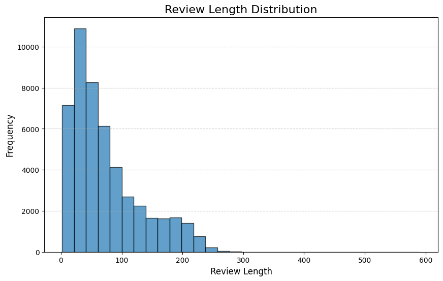

# 리뷰 활성화를 통한 커뮤니티 구축으로 상품 신뢰도와 구매력을 높이는 리워드 보상 체계 구축
## 목표

고객이 리뷰를 더 많이 작성하고, 상세하고 유용한 코멘트를 남기도록 유도하여 커뮤니티 활성화와 상품 신뢰도를 높임

이를 통해 상품 구매력을 증대시키는 것을 목표

## 데이터셋

https://www.kaggle.com/datasets/olistbr/brazilian-ecommerce

## 코멘트 번역

- 번역 모델 : https://huggingface.co/facebook/mbart-large-50-many-to-many-mmt
- 모델 선정 이유
    - mBART-large-50 모델은 50개 언어 간의 번역을 지원하여 다언어 환경에서 번역 작업이 필요한 경우 매우 유용함
    - Hugging Face에서 제공하는 모델을 사용하여 손쉽게 불러오고 조작할 수 있어, 개발 과정에서 효율적으로 활용할 수 있음

## 코멘트 라벨링
- 라벨링 모델 : Roberta
- 모델 선정 이유    
    - BERT는 트랜스포머의 인코더를 사용하는 모델로, 텍스트 전체 문맥을 양방향으로 처리하여 의미를 깊이 이해할 수 있음
    - 이러한 이유로 BERT 기반 모델을 채택했으며, BERT의 기본 구조를 유지하면서 학습 방법과 데이터 크기를 확장한 RoBERTa를 선택

- finetuning model 선택 이유
    - 전체 f1-score, 개별 f1-score을 비교했을 때 ____ 모델이 적합

# 프로젝트 개요

리뷰 작성 리워드 모델 설계

- 문제 정의 및 고객 니즈 분석
- 고객 니즈 기반의 리워드 모델 설계
- 리워드 도입 효과 시뮬레이션

## 사용 스킬
python, A/B Test, DataVisualization

# 이커머스 데이터 분석
1. data summary
    - 통계량(리뷰 길이, 평균 별점, 코멘트 포함 비율)
    히스토그램: 리뷰 길이 분포.
    박스플롯: 별점에 따른 리뷰 길이 분포.
    파이 차트: 코멘트 작성 여부 비율.

2. data preprocessing
    - 포르투갈어 -> 영어
    - 리뷰 라벨링

3. 문제 탐색 및 정의

4. 니즈 파악
    - 상품 품질/ 배송 기간 여부 중요

5. 목표 설정
    - 목적
        - 리뷰 활성화를 통해 커뮤니티를 구축하고, 상품 신뢰도와 구매력을 높일 수 있는 리워드 보상 체계 확립

    - 목표

        - 리워드 제공을 통한 커뮤니티 활성화 및 고객 참여 증대
        - 고객이 더 많은 리뷰를 작성하고, 상세하고 유용한 코멘트를 남기도록 유도하여 상품 신뢰도와 구매력 증대
        - 리워드 보상을 통해 부정적 이미지 완화 및 재구매율 증가 유도
    - 기대 결과

        - 구매자 대상의 리워드 모델 구축
        - 고객 니즈에 기반한 쿠폰 요금 책정
    
6. 리워드 설계 프로세스
    1. 리워드 해택 구성
        - 코멘트 신뢰도 평가
            - 기준 : 코멘트 길이, key word(상품 품질, 배송기간)
            - 코멘트 길이에 대한 기준
            - 신뢰도 평가 및 차등 리워드 구성
                - 모든 기준을 충족한 경우: High 리워드
                - 2개 충족: Mid 리워드
                - 1개 충족: Low 리워드

    2. 리워드 가격 설정
        - 차등 리워드 기준 설정:

            - 신뢰도 평가 항목(코멘트 길이, 키워드 포함 여부)의 포함 개수로 구분하여 리워드 등급을 설정
            - 신뢰도가 높은 고객에게는 높은 리워드를 제공하여 리뷰의 상세성과 참여를 유도
        - 차등 가격 설정:

            - High 리워드: 예) 1,500원
            - Mid 리워드: 예) 1,000원
            - Low 리워드: 예) 500원

    - 리워드 참고
        - 무신사
            - 스타일 후기: 1,500원
            - 상품 사진 후기: 1,000원
            - 일반 후기: 텍스트 작성 시 500원, 사진 추가 시 500원 추가 지급 (최대 1,000원)
            - 사이즈 추천: 100원
            - 구매 확정일로부터 90일 이내
        - 네이버
            - 상품리뷰는 텍스트 리뷰 작성 시 50원, 포토/동영상 리뷰 작성 시 150원
            - 구매 확정 후 30일 이내에 작성한 리뷰에 대해 포인트가 지급되며, 동일 상품에 대해 한 달 사용 후 추가로 리뷰를 작성하면 텍스트 리뷰는 50원, 포토/동영상 리뷰는 150원의 포인트가 지급
    3. 손익 지점 시뮬레이션

        - 시뮬레이션 목표
            각 리워드 등급에서 제공되는 리워드 금액에 따른 수익성을 평가
            리워드 제공에 따른 추가 구매 증가율과 수익 증가 효과를 시뮬레이션
        - 손익 지점 분석
            - 리워드 금액에 따른 예상 수익을 계산하여, 손익 지점을 찾기
            - 시뮬레이션 방법:
                - 리워드 제공 전후의 평균 구매 수 비교
                - 리워드 제공에 따른 예상 추가 거래액을 기반으로 수익성 분석

    4. 손익 지점 검증

    
    
        1. 목표
            - 수익이 0 이상(수익 ≥ 0)인 리워드 조합을 찾는 것을 목표로 합니다.

        ---

        2. 시뮬레이션 조건

            1) 리워드 구성
            - 리워드는 신뢰도(High, Mid, Low, Very Low)에 따라 금액이 다르게 책정됩니다.
            - 예시 1: `H:3, M:2, L:1, VL:0`
            - 예시 2: `H:9, M:6, L:4, VL:0`

            2) 목표
            - 각 리워드 조합에서 수익 ≥ 0이 되기 위한 성장률을 찾습니다.
            - **High-rate 성장률**: 높은 리워드 조합에서 필요한 성장률
            - **Low-rate 성장률**: 낮은 리워드 조합에서 필요한 성장률

            3) Increase-rate 조정
            - High-rate와 Low-rate의 **기하평균**을 계산하여 최적의 Increase-rate를 설정합니다.

            4) 가정
            - 리워드를 제공하면 Increase-rate에 비례하여 성장률이 증가한다고 가정합니다.

            5) 기준
            - **수익 > 0**, 그리고 **수익이 0에 가까운 리워드 조합**을 선택합니다.

        ---

        3. 실행 계획
            1) 랜덤 리워드 조합 생성
            랜덤으로 리워드 조합을 생성하여 데이터 크기(len(df))만큼 샘플링.
            2) 2000회 시뮬레이션
            각 조합에 대해 2000번 시뮬레이션 실행.
            분포 및 통계량 확인.
            3) 리워드 1개 선택 기준
            수익 > 0을 만족하며, 수익이 0에 가장 가까운 조합을 선택.

        ---

        4. 결과 도출

            1) 최적 리워드 조합
            - 시뮬레이션 결과에서 선택된 **리워드 조합 5개의 상세 내역**과 **수익 분포**를 확인합니다.

            2) 수익 조건 충족 여부
                - **수익이 0 이상**인지 확인하며, **수익이 0에 가장 가까운 조합**을 선택합니다.

        ---

        5. 결론 및 제안

        - 결론
            - 본 시뮬레이션을 통해, 특정 리워드 조합이 수익 ≥ 0을 만족시키는지를 확인할 수 있었습니다. 최적의 리워드 조합과 성장률을 도출했습니다.

        - 제안
            - 향후 테스트 환경에서는 고객의 신뢰도 분포 및 소비 패턴을 더 정밀히 반영한 데이터로 실험을 반복하여 정확성을 높여야 합니다.
        ---

        > 참고
        해 찾기 : https://www.youtube.com/watch?v=DclCR6_jizQ
        